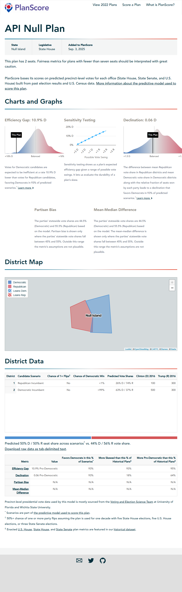

<!-- README.md is generated from README.Rmd. Please edit that file -->

# PlanScoreR

<!-- badges: start -->

[](https://github.com/christopherkenny/PlanScoreR/actions/workflows/R-CMD-check.yaml)
<!-- badges: end -->

`PlanScoreR` offers an R interface to PlanScore.org’s API.

## Installation

You can install the development version of PlanScoreR from
[GitHub](https://github.com/) with:

``` r
# install.packages('remotes')
remotes::install_github('christopherkenny/PlanScoreR')
```

## Authentication

To use PlanScoreR, you must have an API key from PlanScore. Otherwise,
you will get a 403 forbidden error.

To get a key, follow the [instructions
here](https://github.com/PlanScore/PlanScore/blob/main/API.md).

Once you have a key, use `ps_set_key('your_key')`. Optionally use
`ps_set_key('your_key', install = TRUE)` to allow your key to be
available across sessions.

## Example

With a file, you can upload using the `ps_upload_file()` option:

``` r
library(PlanScoreR)
## basic example code

file <- system.file('extdata/null-plan-incumbency.geojson', package = 'PlanScoreR')
links <- ps_upload_file(file)
#> ℹ Using single-step upload.
```

To read the data results:

``` r
ps_ingest(links)
#> # A tibble: 2 × 62
#>   district democratic_…¹ democ…² democ…³ repub…⁴ repub…⁵ us_pr…⁶ us_pr…⁷ distr…⁸
#>   <chr>            <dbl>   <dbl>   <dbl>   <dbl>   <dbl>   <dbl>   <dbl>   <int>
#> 1 1                 155.    29.9   0        445.    29.9     100     300       0
#> 2 2                 379.    29.6   0.998    221.    29.6     500     300       1
#> # … with 53 more variables: polsby_popper <dbl>, reock <dbl>,
#> #   declination <dbl>, declination_absolute_percent_rank <dbl>,
#> #   declination_is_valid <dbl>, declination_positives <dbl>,
#> #   declination_relative_percent_rank <dbl>, declination_sd <dbl>,
#> #   efficiency_gap <dbl>, efficiency_gap_1_dem <dbl>,
#> #   efficiency_gap_1_dem_sd <dbl>, efficiency_gap_1_rep <dbl>,
#> #   efficiency_gap_1_rep_sd <dbl>, efficiency_gap_2_dem <dbl>, …
```

To capture the outputted figures on the site:

``` r
img <- 'man/figures/README-planscore.png'
ps_capture(links, img)
#> [1] "man/figures/README-planscore.png"

knitr::include_graphics(img)
```


